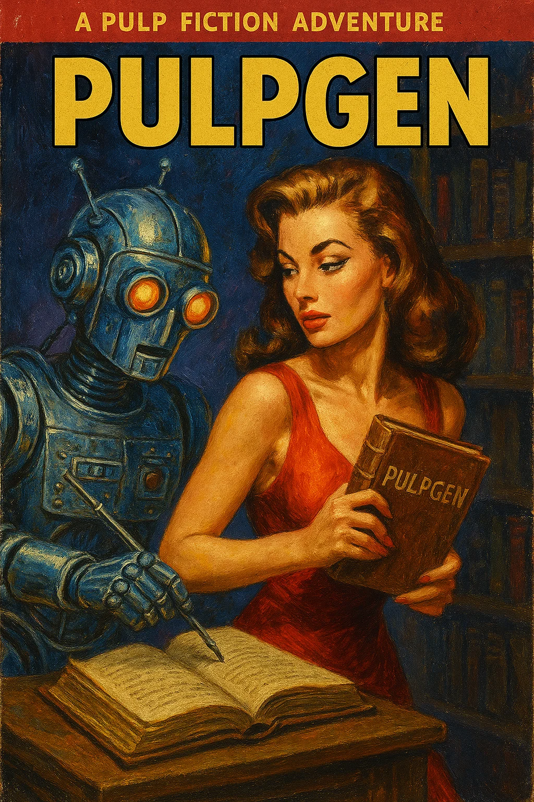
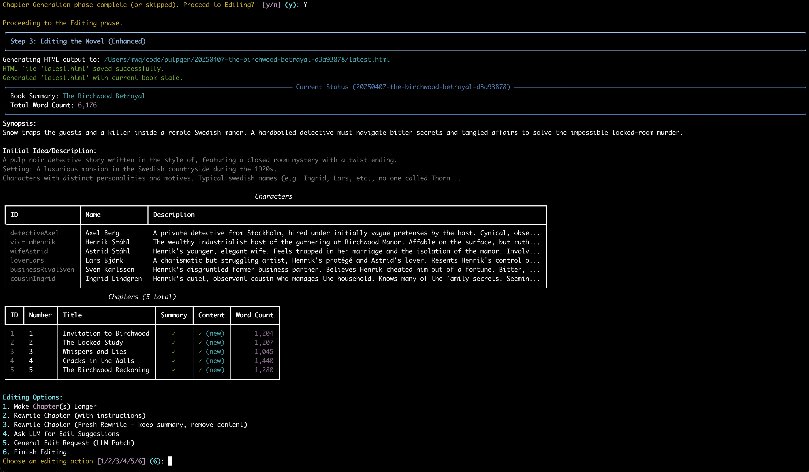

# 📚 pulpgen: Your Ghostwriter in the Machine - An AI Novel Drafting Agent


*A PULP FICTION ADVENTURE*

---

**What is it?** `pulpgen` is a command-line tool that uses AI (Google Gemini) to automatically write a complete first-draft novel based on your idea/prompt. It handles outlining, chapter writing, and interactive AI-assisted editing.



---

## ⚡ Quick Start

1.  **Install:** Requires Python 3.13+ and `uv`.
    ```bash
    # Clone or download the code first
    cd pulpgen
    uv sync
    ```
2.  **API Key:** Create a `.env` file in the `pulpgen` directory with `GEMINI_API_KEY="YOUR_KEY_HERE"` or enter the key when prompted on first run.
3.  **Run (New Project):**
    ```bash
    # Example using a prompt file:
    uv run python pulpgen.py --prompt your_idea.txt
    # Or run without --prompt to enter idea interactively
    ```
4.  **Run (Resume Project):**
    ```bash
    uv run python pulpgen.py --resume path/to/your/project_folder
    ```
5.  **Output:** Finds/creates a project folder (like `YYYYMMDD-slug-uuid`) containing XML state files and the final manuscript in `final.html`.

---

## Calling All Wordsmiths!

Got a killer story idea burning a hole in your pocket, but staring down the barrel of a blank page? Need a first draft hammered out faster than a speeding locomotive? Step right up and meet **`pulpgen`** – your personal, tireless AI wordsmith, ready to spin your concept into a full-length novel draft before the deadline hits!

Think of `pulpgen` as your commissioned ghostwriter, operating straight from the command line. Feed it your high-concept premise, and this digital scribe, powered by the mighty Google Gemini LLMs, will autonomously navigate the treacherous path from outline to finished typescript. It handles the grunt work – plotting, drafting, even taking editorial notes – leaving you free to crack the whip (or just polish the final product).

## The Lowdown: What This Mechanical Marvel Does

*   **Autonomous Drafting:** Give `pulpgen` the brief (your story idea), and watch it execute a multi-stage operation to deliver a complete first draft.
*   **AI Story Engine:** Leverages Google Gemini models for the heavy lifting: conjuring characters, plotting chapter-by-chapter action, churning out prose, and even performing revision passes based on your instructions.
*   **Structured Mayhem (The Workflow):** Follows a tried-and-true process:
    1.  **Laying the Foundation:** Generates characters and detailed chapter summaries from your initial spark.
    2.  **Hitting the Keys:** Writes the full prose, chapter by chapter, using the outline as its map and context from previous chapters. Works in batches to keep the ink flowing.
    3.  **The Editor's Gauntlet (Interactive Revision):** Enters an interactive editing phase where *you* call the shots! Direct the AI using a menu of tools to refine the draft (more below).
    4.  **Binding the Pages:** Consolidates the final manuscript into clean XML and reader-friendly HTML.
*   **Never Loses the Thread (Persistence & Resume):** Meticulously logs its progress in XML files (`outline.xml`, `patch-*.xml`). If the operation gets interrupted (power outage, sudden inspiration strike), `pulpgen` can pick up right where it left off, ensuring no word is wasted. Just point it back to the case folder!
*   **Clear Dispatches:** Keeps you updated via the command line, showing its progress through each phase like chapter markers in a thrilling serial.
*   **Flexible Intel:** Accepts your initial book idea typed directly or loaded from a dossier (text file).
*   **The Finished Manuscript:** Delivers the goods as both structured XML (`final.xml`) for data wranglers and readable HTML (`final.html`, plus versioned copies) ready for the presses (or your favorite editor).

## Gear Up, Gumshoe! (Requirements)

*   **Python 3.13:** The specific vintage required for this operation.
*   **`uv` Package Manager:** The latest tool for wrangling Python dependencies ([Get uv here](https://github.com/astral-sh/uv)).
*   **Google Gemini API Key:** Your access pass to the AI engine room. Obtainable from Google AI Studio.

## Setting Up Shop (Installation)

1.  **Get the Blueprints:** Clone or download the `pulpgen` repository.
    ```bash
    # If using git:
    # git clone <repository-url>
    cd pulpgen
    ```
2.  **Assemble the Tools:** Use `uv` to install dependencies specified in `pyproject.toml`.
    ```bash
    uv sync
    ```
3.  **Secure Your Credentials (API Key):**
    *   **Method 1 (Recommended):** Create a `.env` file in the `pulpgen` project directory:
        ```dotenv
        # .env
        GEMINI_API_KEY="YOUR_SECRET_API_KEY_GOES_HERE"
        ```
    *   **Method 2 (On-the-Fly):** If the `.env` file is missing, the script will prompt you to enter the key securely when you first run it.

## Firing Up the Engine (Usage)

Launch the `pulpgen` agent from your terminal within the project directory:

```bash
uv run python pulpgen.py [OPTIONS]
```

**Command-Line Options:**

*   `--resume FOLDER_PATH`: Point to an existing project folder (e.g., `20240315-space-opera-saga-f3a4b1c9`) to continue a previously started job.
*   `--prompt FILE_PATH`: Provide the path to a `.txt` file containing your book idea. This is only used when starting a *new* project (ignored if `--resume` is used).

**Running the Agent:**

1.  **New Case or Old Lead?**
    *   If you use `--resume <FOLDER_PATH>`, `pulpgen` will load the state from that directory and ask to continue.
    *   If you *don't* use `--resume`, `pulpgen` checks for existing project folders. It will list them and ask if you want to **resume** one or **start a new** project.
2.  **Starting a Fresh Yarn:**
    *   If you used `--prompt <FILE_PATH>`, it reads the idea from there.
    *   Otherwise, it prompts you to type or paste your **book idea** directly.
    *   It asks for the approximate **number of chapters** you envision.
    *   `pulpgen` creates a new project folder (named like `YYYYMMDD-slug-uuid`), saves the initial `outline.xml` containing your idea.
    *   The agent then automatically kicks off the generation workflow (Outline -> Content -> Editing).
3.  **Resuming an Old Case:**
    *   Select the project folder to resume.
    *   `pulpgen` loads the latest state by reading `outline.xml` and applying all existing `patch-*.xml` files (or loading `final.xml` if present and applying subsequent patches).
    *   It automatically continues the workflow from the phase where it left off.

## Inside the Dossier (Project Files)

`pulpgen` keeps its work organized in a dedicated project folder (e.g., `20240315-robot-romance-a1b2c3d4`):

*   **`YYYYMMDD-slug-uuid/` (Project Folder):** The main case file, named with the date, a slugified title, and a unique ID.
*   **`outline.xml`:** The initial blueprint. Contains metadata (title, synopsis, your idea), character profiles, and chapter summaries generated in Phase 1. This is the starting map.
*   **`patch-NN.xml`:** Sequential dispatch logs. Each patch records a chunk of generated chapter content (Phase 2) or the results of an editing action (Phase 3). When resuming, `pulpgen` replays these patches to reconstruct the story's current state. Essential for tracking the narrative's evolution. `NN` is a zero-padded number (e.g., `patch-01.xml`, `patch-02.xml`).
*   **`final.xml`:** The consolidated, complete manuscript draft produced at the very end of the process. Contains everything from the outline and all applied patches.
*   **`final.html`:** A clean, readable HTML version of the final draft, suitable for reading or importing elsewhere.
*   **`version-NN.html`:** HTML snapshots generated after each *content generation* or *editing* patch (`patch-NN.xml`) is saved. Allows you to review the draft at intermediate stages.
*   **`latest.html`:** Always points to the HTML version of the *most recent* state (updated after every patch save). Useful for quick reviews during the process.

## The Assembly Line: From Spark to Manuscript

Once you kick off a new project, `pulpgen` works autonomously through these phases:

**Phase 1: Laying the Foundation (Outline Generation)**

*   **Agent Action:** Takes your initial idea and target chapter count. Instructs the AI to flesh out:
    *   A compelling title and synopsis.
    *   A cast of characters (`<characters>`) with names and brief descriptions.
    *   Detailed summaries for each chapter (`<chapters>`), outlining the plot progression.
*   **Output:** Saves the complete structure to `outline.xml`. The patch counter is reset to 0.

**Phase 2: Hitting the Keys (Content Drafting)**

*   **Agent Action:** Systematically works through the `outline.xml`. Selects batches of chapters needing content (using a spread/fill strategy to provide context). Instructs the AI to write the full prose for each selected chapter, guided by its summary and the overall narrative context.
*   **Output:** Saves generated chapter content in sequential `patch-NN.xml` files. Updates `version-NN.html` and `latest.html` after each patch.

**Phase 3: The Editor's Gauntlet (Interactive Revision & Refinement)**

*   **Agent Action:** This is where you step back in! `pulpgen` presents an interactive menu with powerful editing tools that leverage the AI:
    *   **Make Chapter(s) Longer:** Select chapters and specify a target word count; the AI rewrites them to be more expansive.
    *   **Rewrite Chapter (with instructions):** Choose a chapter and provide specific instructions; the AI rewrites its content based on your direction, keeping the original summary.
    *   **Rewrite Chapter (Fresh Rewrite):** Similar to above, but the AI is *not* shown the chapter's *current* content (only the summary and context), encouraging a completely fresh take based on your instructions.
    *   **Ask LLM for Edit Suggestions:** The AI analyzes the *entire* current draft and provides a numbered list of potential improvements (pacing, character arcs, consistency, etc.). You can then choose one suggestion for the AI to attempt implementing via a patch.
    *   **General Edit Request (LLM Patch):** Provide broad instructions (e.g., "Improve dialogue in Act 2", "Check for plot holes related to the MacGuffin"). The AI analyzes the draft and generates a patch file attempting to address your request.
*   **User Interaction:** You select the tool, provide necessary input (chapter IDs, instructions, target word counts), and **confirm** whether to apply the AI-generated patches (`patch-NN.xml`).
*   **Output:** Applied revisions are recorded in new `patch-NN.xml` files. `version-NN.html` and `latest.html` are updated after each confirmed patch.

**Phase 4: Binding the Pages (Finalization)**

*   **Agent Action:** Once you exit the Editing phase, `pulpgen` consolidates the `outline.xml` and all applied `patch-*.xml` files into the definitive final manuscript.
*   **Output:** Produces `final.xml` and the polished `final.html`.

## Whispers from the Editor's Desk (Tips for Success)

1.  **A Solid Blueprint:** The richer and clearer your initial book idea, the better the foundation the AI has to build upon. Don't skimp on the concept!
2.  **Master the Editing Tools:** Phase 3 is your chance to steer the ship. Use the interactive editing options strategically. Need more depth? *Make Longer*. Plot point feels weak? *Rewrite with Instructions*. Staring at a mess? *Fresh Rewrite* might help. Unsure what's wrong? *Ask for Suggestions*. Got a specific fix? *General Edit Request*.
3.  **Embrace the First Draft:** `pulpgen` delivers a *first draft*. It's designed to rapidly get words on the page based on your directions. Expect to perform further human editing and polishing on the `final.html` or `final.xml`.
4.  **Expect Quirks:** AI, even sophisticated ones like Gemini, can sometimes introduce inconsistencies, repeat phrases, or have stylistic hiccups. Keep an eye out during the interactive editing phase and be prepared for final manual touch-ups.
5.  **Trace the Clues (Optional):** The `patch-*.xml` files and `version-*.html` files are your audit trail. If something seems off, you can examine how the story evolved step-by-step.
6.  **Iterate and Experiment:** Not thrilled with the outcome? Tweak your initial idea, refine your editing instructions in Phase 3, or even start a new `pulpgen` run. Sometimes the second attempt hits the mark!

## Under the Hood (Optional Tinkering)

*   **API Key:** Managed via `.env` file or interactive prompt (see Installation).
*   **Advanced Tweaks:** For seasoned operators, constants within `pulpgen.py` like `WRITING_MODEL_NAME` and `WRITING_MODEL_CONFIG` allow changing the underlying Gemini model or adjusting generation parameters (temperature, top_p, etc.). Proceed with caution!

## The Fine Print (License)

MIT License. See the [LICENSE](LICENSE) file for the legalese.

---

Now, fire up `pulpgen` and let the AI ghostwriter spin your next great yarn! Good luck, agent!
